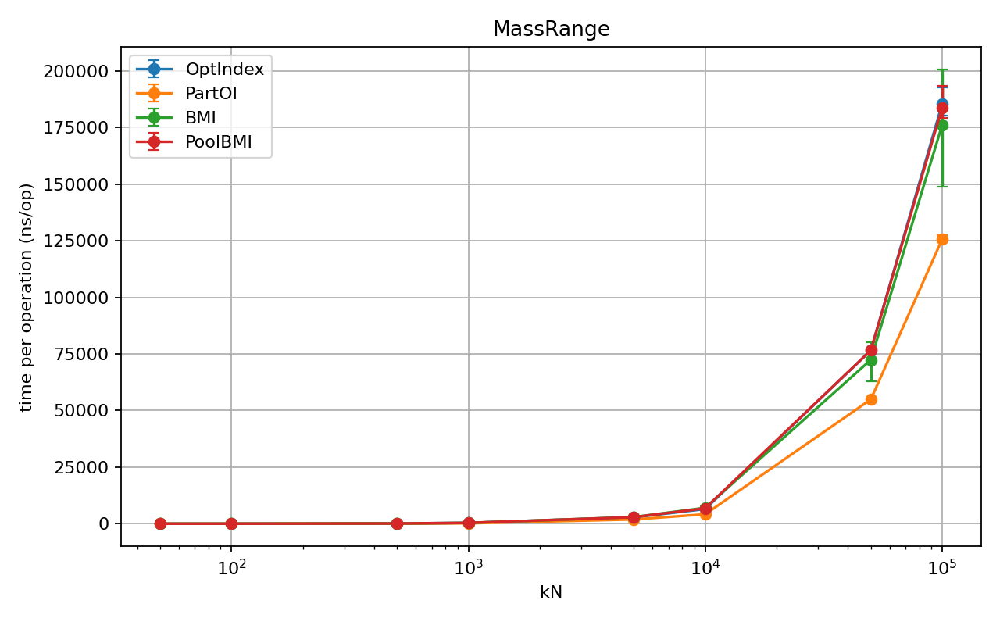
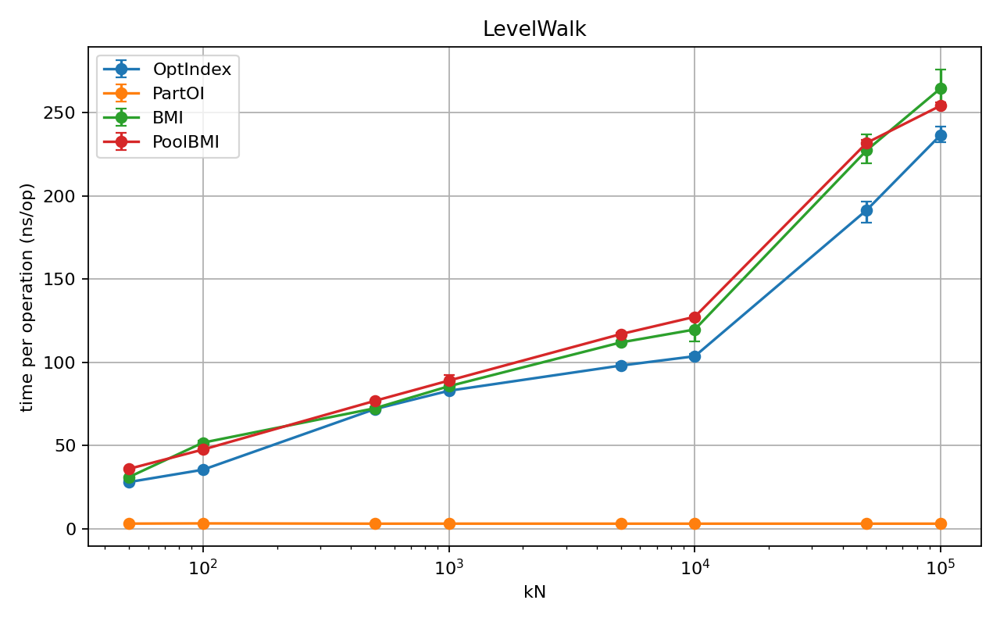
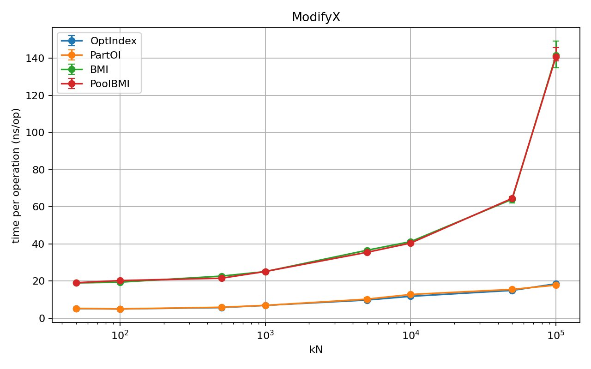
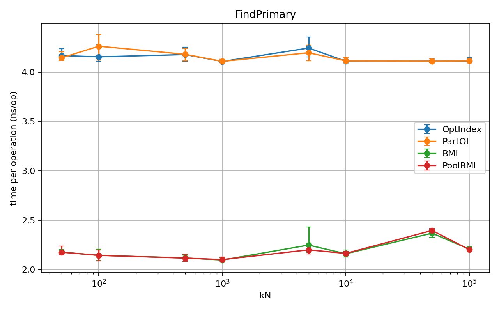
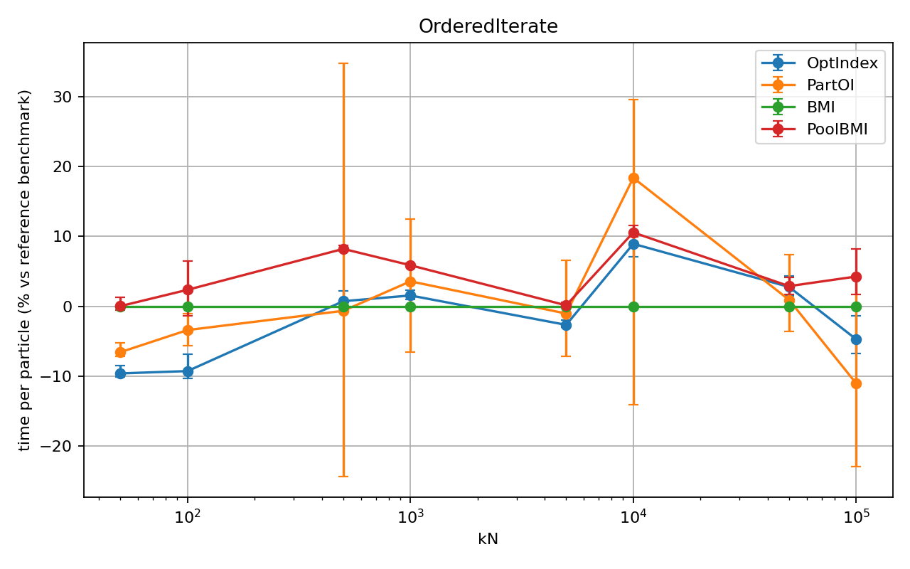
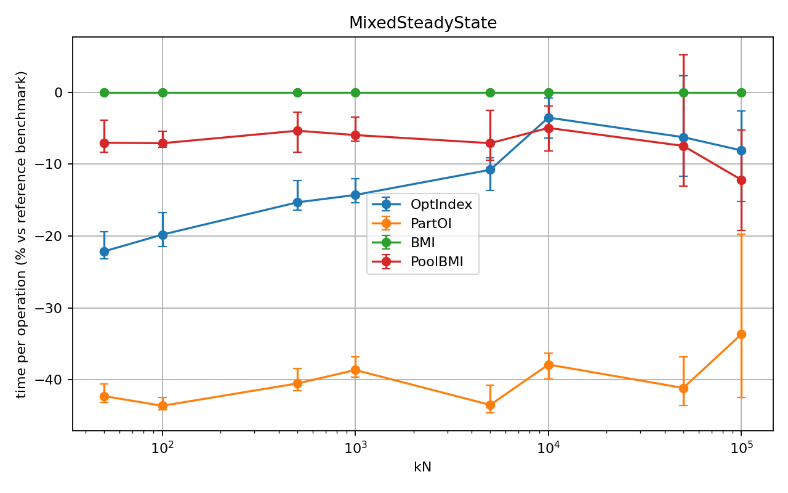

# OptIndex: One storage, optional and partitioned views

`optindex::OptIndex` is an object store targeted at low latency applications. The philosophy is indicated in the name: it allows for optional and partitioned indexing, or *views*, over a collection of objects. Any mutation must preserve cross-index invariants, and failure/rollback must work even when an object is only partially indexed. On one hand, it provides centralized storage management and RAII guarantees, similar to std containers, and compile-time multi-indexing resembling Boost.MultiIndex. On the other hand, it provides very flexible mechanism allowing for partial and partitioned indexing, allowing for efficient insertion, removal, and iterating over different *views*, as well as zero-cost *migration* between partitioned indices.

## Why this exists

If you already know the object count upper bound and you care about latency, the usual approach of "one container per query pattern" gets expensive fast:

- the payload is duplicated or indirectly owned in several places
- updates have to be mirrored across containers
- allocator traffic and fragmentation show up at the wrong time
- locality gets worse when hot objects are spread out

In this context, Boost.MultiIndex and Boost.Intrusive are popular tools and somehow represent two extremes of the design space. The MultiIndex has existed for years and is a powerful general-purpose solution, while its model assumes that each object participates in all views. This essentially forbids the case of partial indexing: some of the objects may have only "retired" from some indices and the same key may need to be partitioned or bucketed into different indices. Intrusive, however,is relatively more recent and provides very flexible building blocks for the indexing layer, allowing the user to decide the full logic of inserting into/removing from individual containers and assuming essentially nothing about the lifetime and ownership of the underlying objects. One therefore has to be very careful to define and enforce necessary contracts to guarantee objects are consistently managed. 
 
OptIndex tries to fill the space between the two, and to pinpoint a recurring paradigm that is both safe and maximally flexible:

- store each object once
- attach multiple hooks to that one object, to which indices can be attached (via `boost::intrusive` containers)
- choose the index set at compile time
- allow one hook to have multiple possible indices (partitioned index), but enforce one-index-a-time contract.
- allow for indexing/unindexing objects within individual containers at runtime
- compatible with std::allocator_traits while shipped with a fixed-size LIFO pool for storage (can be replaced with any std-compatible allocators)

That gives you a unified interface for repeated mixed queries with minimal runtime machinery, allowing for flexible use cases with intrusive containers.

## Design

The design is intentionally simple.

**1. Policy-based indices.**  
The index set is declared in the type. No virtual dispatch, no runtime registry, no dynamic query planner. You pay for the indices you ask for.

**2. One object, many indices.**  
The payload exists once. The indices are just alternate access paths to the same object.

**3. LIFO memory pool.**  
This is not mandatory but the default storage comes from a fixed pool with LIFO reuse. The point is to avoid general-purpose allocator noise, reduce fragmentation, and keep recently-touched slots hot when the workload is bursty. `optindex::FixedSizeOptIndex` uses this pool by default.

**4. Explicit indexing control when needed.**  
You can insert into the primary index only, then opt into selected secondary indices later. That matters when object construction and indexing have to be staged. This is the most significant difference in design compared with similar libraries such as `boost::multi_index`, as we allow for partial indexing in general.

**6. K>1 partitioned buckets.**  
A single `IndexBy` can declare multiple tags that share one intrusive hook. At most one tag can be active per slot at a time — the encoded membership is stored in a compact bitfield. This lets you partition objects into disjoint categories (e.g. Low/Mid/High) without allocating a separate hook per bucket. Migrating an object from one bucket to another is a `unindex<OldTag>` + `insert<NewTag>` pair.

## When it fits

This container is a good fit when:

- objects are relatively large
- the working set has a known maximum size
- the same live objects are queried repeatedly in different ways
- latency matters more than generality
- you want predictable failure on exhaustion instead of unbounded growth

Less ideal when:

- capacity is not known ahead of time
- you need arbitrary ad hoc query types
- you mainly want a drop-in STL replacement

## Quick example

The examples below use the same `Particle` type and index setup as the benchmarks and tests.

```cpp
#include <cstddef>
#include <cstdint>
#include "optindex.h"

struct Particle {
  uint64_t id;
  double x;
  double y;
  double m;

  Particle(uint64_t id, double x, double y, double m)
      : id(id), x(x), y(y), m(m) {}
};

struct ById {};
struct ByX {};
struct ByY {};
struct ByM {};
struct BySeq {};

static constexpr std::size_t kMaxParticles = 64;

using ParticleMap = optindex::FixedSizeOptIndex<
    Particle, kMaxParticles,
    optindex::Ordered<optindex::KeyFrom<&Particle::id>, std::less<uint64_t>>,
    optindex::IndexBy<optindex::Ordered<optindex::KeyFrom<&Particle::x>, std::less<double>>, ByX>,
    optindex::IndexBy<optindex::Ordered<optindex::KeyFrom<&Particle::y>, std::less<double>>, ByY>,
    optindex::IndexBy<optindex::OrderedNonUnique<optindex::KeyFrom<&Particle::m>, std::less<double>>, ByM>,
    optindex::IndexBy<optindex::List, BySeq>>;
```

This map has five views over the same `Particle` objects:

- primary index: ordered unique by `id`
- `ByX`: ordered unique secondary index by `x`
- `ByY`: ordered unique secondary index by `y`
- `ByM`: ordered non-unique secondary index by `m` (particle mass)
- `BySeq`: insertion-order list

We can imagine a simple game where particles can move in the two-dimensional space. Each of `x` and `y` coordinates cannot be identical for any two particles. We will want to add/remove particles, iterate over them in different orders (insertion order, by id, or ascending `x`/`y`), and find all particles with the same mass.

## Basic usage

### Insert

Create and index into all configured secondary indices:

```cpp
ParticleMap map;

auto it = map.create_all(1, 0.0, 0.0, 1.0);
if (it == map.cend()) {
  // failed: capacity exhausted or a unique index rejected it
}
```

If `create_all` hits a conflict in a secondary unique index, the insert is rolled back completely. The object does not survive in the primary index as a half-inserted entry.

Create into the primary index only, then opt into secondary indices:

```cpp
auto it = map.create(99, 7.0, 8.0, 3.0);
if (it != map.cend()) {
  map.insert<ByX>(*it);   // add to x-index
  map.insert<BySeq>(*it); // add to list index
  // ByY and ByM remain unlinked
}
```

That is useful when secondary indexing is conditional or staged.

### Find by primary key

```cpp
auto it = map.find_primary(42u);
if (it != map.cend()) {
  double x = it->x;
  double y = it->y;
}
```

### Ordered iteration

Iterate by `x` in sorted order:

```cpp
for (const auto& p : map.get<ByX>()) {
  // p.x is nondecreasing
}
```

Iterate in insertion order:

```cpp
for (const auto& p : map.get<BySeq>()) {
  // insertion order
}
```

### Non-unique range queries

Get all particles with the same mass:

```cpp
auto& mi = map.get<ByM>();
auto [beg, end] = mi.equal_range(5.0);

for (auto it = beg; it != end; ++it) {
  // every particle here has m == 5.0
}
```

Walk distinct mass levels:

```cpp
for (auto it = mi.begin(); it != mi.cend(); it = mi.upper_bound(it->m)) {
  // one representative per distinct mass value
}
```

### Remove

Remove by object handle:

```cpp
auto it = map.find_primary(1u);
if (it != map.cend()) {
  map.remove(*it);
}
```

Remove by key through a unique secondary index:

```cpp
bool removed = map.remove<ByX>(3.14);  // remove by x
```

### Deindex a secondary view without deleting the object

```cpp
auto it = map.create_all(1, 1.0, 1.0, 1.0);

map.unindex<ByX>(*it);  // remove from x-index only; object stays in primary

auto again = map.find_primary(1u);  // still found
```

### Project across indices

If you found an object through one index and want the iterator for another index, use `project<Tag>`:

```cpp
auto& mi = map.get<ByM>();
auto mit = mi.find(7.0);

if (mit != mi.cend()) {
  auto lit = map.project<BySeq>(*mit);
  if (lit != map.get<BySeq>().cend()) {
    // same object, now as a list-index iterator
  }
}
```

If the object is not currently indexed in the target index, `project<Tag>` returns that index's `end()`.

### Modify and reindex one field

If you mutate a field that participates in an index, pass the affected tags to `modify`:

```cpp
auto it = map.create_all(1, 1.0, 3.0, 2.0);

bool ok = map.modify<optindex::ReindexOnly<ByX>>(
    *it, [](Particle& p) { p.x = 9.0; });

if (!ok) {
  // unique-index conflict; original state was restored
}
```

For non-unique indices, reindex always succeeds:

```cpp
map.modify<optindex::ReindexOnly<ByM>>(
    *it, [](Particle& p) { p.m = 7.0; });
```

`modify` checks whether the slot is out of order after mutation and only unindexes and reindexes if needed. Unlinked tags are skipped. You can name multiple tags to reindex in one call:

```cpp
map.modify<optindex::ReindexOnly<ByX, ByY>>(
    *it, [](Particle& p) { p.x = 2.0; p.y = 4.0; });
```

### K>1 partitioned buckets

One `IndexBy` can carry multiple tags sharing a single intrusive hook. Objects belong to at most one tag at a time, with membership encoded in a compact bitfield. This lets you partition objects into disjoint categories without per-object extra overhead:

```cpp
struct BktLow  {};
struct BktMid  {};
struct BktHigh {};

using ParticleBuckets = optindex::FixedSizeOptIndex<
    Particle, kMaxParticles,
    optindex::Ordered<optindex::KeyFrom<&Particle::id>, std::less<uint64_t>>,
    optindex::IndexBy<optindex::List, BktLow, BktMid, BktHigh>>;

ParticleBuckets map;
auto it = map.create(1, 0.0, 0.0, 2.5);

map.insert<BktLow>(*it);   // link to low bucket

// Migrate to high bucket: unindex, update the bucket-driving state, then insert.
// The container enforces one active bucket per hook; your code owns the
// domain rule that decides which bucket is correct.
map.unindex<BktLow>(*it);
map.modify<optindex::ReindexNone>(*it, [](Particle& p) { p.m = 9.0; });
map.insert<BktHigh>(*it);

// Iterate one bucket only
for (const auto& p : map.get<BktHigh>()) { /* ... */ }
```

`insert<Tag>` returns `false` if the slot is already occupied by any tag in the same `IndexBy` group — call `unindex<OldTag>` first.

## Semantics at a glance

- `create(...)`  
  Create object and index it into the primary only.

- `create_all(...)`  
  Create object and index it into all configured secondary indices.

- `insert<Tag>(obj)`  
  Add an existing object to secondary index `Tag`. Returns `false` if already linked to any tag in the same slot.

- `unindex<Tag>(obj)`  
  Remove an object from secondary index `Tag` only. Returns `false` if not linked.

- `get<Tag>()`
  Access the container for secondary index `Tag`.

- `find_primary(key)`  
  Find through the primary index.

- `remove(obj)`  
  Remove the object from the container entirely (all secondaries + primary, destroys slot).

- `remove<Tag>(key)`  
  Remove by secondary key when the index is unique.

- `project<Tag>(obj)`  
  Get the iterator for the same object in `Tag`'s container, or `end()` if not linked there.

- `modify<optindex::ReindexOnly<Tags...>>(obj, fn)`
  Mutate the object and reindex only the listed tags that are out of order. Rolls back on unique-index conflict.

## Failure model

This library aims to fail in boring ways.

- Pool exhaustion returns `cend()`.
- Duplicate primary keys are rejected.
- Secondary unique-index conflicts during `create_all` roll back the whole insert.
- Unique-index conflicts during `modify` roll back the object state.
- `project<Tag>` returns `end()` when the object is not linked in that index.
- `insert<Tag>` returns `false` when the slot is already occupied (no silent migration).

That is the intended contract: no ghost entries, no half-updated indices, no dangling hooks after a normal failed operation.

## Notes

This is an intrusive-based container for a specific low-latency workload. It is not trying to be a general-purpose database or a universal associative container. Especially if your object count is bounded and the same objects must be hit through several access paths (potentially partitioned) repeatedly, that is the use case it is built for.

## Benchmarks

Benchmarks compare four implementations with Google Benchmark:

- **OptIndex** - `optindex::FixedSizeOptIndex` with one ordered, non-unique mass index.
- **PartOI** - `optindex::FixedSizeOptIndex` with the mass index replaced by `K=10` partitioned list buckets.
- **PoolBMI** - `boost::multi_index` with `boost::fast_pool_allocator`.
- **BMI** - `boost::multi_index` with the default allocator.

The benchmark fixture uses the same `Particle` idea as the examples, but with a larger `112` byte payload. The current gbench data was generated on 2026-05-16 with `WITH_HASH=true`, so the primary `id` lookup is hashed for all implementations. The other views are ordered unique indices on `x` and `y`, an insertion-order sequence, and either an ordered `m` index (`OptIndex`, `BMI`, `PoolBMI`) or ten integer mass buckets (`PartOI`).

That last difference matters: `PartOI` is not a drop-in replacement for an ordered non-unique mass index. It is a specialized layout for the benchmark's discrete integer mass distribution. It is the right comparison if your workload can use partitioned buckets, but it should not be read as a general ordered-index result.

Two index-layout variants are measured: the default layout and `REV_INDEX=true`, which changes the secondary hook/index order while leaving the payload fields fixed. Most rows below are isolated operation-level microbenchmarks; `MixedSteadyState` is a composed pressure scenario.

The following tables report medians from 200 stored gbench repetitions at **kN = 100,000**. Lower is better. `BulkIterate` and `OrderedIterate` are normalized to ns/particle. `MassRange` is shown as us/op, `MixedSteadyState` as ms/op, and the remaining rows as ns/op. The generated CSV also contains p5/p95 bands, which are important for the noisier traversal rows.

### Default index layout

| Operation | PartOI | OptIndex | PoolBMI | BMI | Notes |
|---|---:|---:|---:|---:|---|
| **Create** | 361 ns | 467 ns | 510 ns | 527 ns | Insert and index all views |
| **FindPrimary** | 4.11 ns | 4.11 ns | 2.20 ns | 2.21 ns | Hashed lookup by `id` |
| **Modify** | 30.7 ns | 113 ns | 174 ns | 176 ns | Move mass to another level/bucket |
| **ModifyX** | 17.8 ns | 18.5 ns | 141 ns | 142 ns | Rekey ordered unique `x` |
| **Remove** | 111 ns | 138 ns | 136 ns | 162 ns | Erase by primary key |
| **BulkIterate** | 3.93 ns | 4.45 ns | 3.65 ns | 3.91 ns | Insertion-order scan |
| **OrderedIterate** | 24.6 ns | 26.3 ns | 28.8 ns | 27.6 ns | Ordered `x` traversal |
| **LevelWalk** | 3.08 ns | 237 ns | 254 ns | 265 ns | Distinct mass-level walk |
| **MassRange** | 126 us | 185 us | 184 us | 176 us | Count matching mass range/bucket |
| **MixedSteadyState** | 1.85 ms | 2.69 ms | 2.56 ms | 2.82 ms | Churn, mass updates, lookups, and scan |

### Reversed index layout

| Operation | PartOI | OptIndex | PoolBMI | BMI | Notes |
|---|---:|---:|---:|---:|---|
| **Create** | 363 ns | 470 ns | 509 ns | 525 ns | Insert and index all views |
| **FindPrimary** | 4.11 ns | 4.11 ns | 2.21 ns | 2.21 ns | Hashed lookup by `id` |
| **Modify** | 30.9 ns | 111 ns | 173 ns | 175 ns | Move mass to another level/bucket |
| **ModifyX** | 18.8 ns | 19.5 ns | 149 ns | 154 ns | Rekey ordered unique `x` |
| **Remove** | 112 ns | 143 ns | 135 ns | 162 ns | Erase by primary key |
| **BulkIterate** | 3.99 ns | 4.40 ns | 3.67 ns | 3.98 ns | Insertion-order scan |
| **OrderedIterate** | 31.9 ns | 37.5 ns | 28.7 ns | 26.4 ns | Ordered `x` traversal |
| **LevelWalk** | 3.09 ns | 231 ns | 253 ns | 265 ns | Distinct mass-level walk |
| **MassRange** | 126 us | 186 us | 183 us | 170 us | Count matching mass range/bucket |
| **MixedSteadyState** | 1.88 ms | 2.98 ms | 2.55 ms | 2.82 ms | Churn, mass updates, lookups, and scan |

### Key findings

**Partitioned mass buckets change the shape of mass-centric work.** `PartOI` is consistently fastest for `Create`, `Remove`, `Modify`, `LevelWalk`, and `MassRange` in this sweep. This is expected rather than magical: the benchmark mass values are integers in `{1..10}`, so `PartOI` can replace tree work with direct bucket work. That is an algorithmic/layout win, not a small constant-factor trick.


*Mass range or bucket count, default index layout.*


*Level walking across discrete mass values, default index layout.*

**Reindexing one ordered unique field is where OptIndex's intrusive design is clearest.** `OptIndex` and `PartOI` are around `18-20 ns` for `ModifyX` at 100k, while the Boost.MultiIndex variants are around `141-154 ns`. In this run the plain and partitioned OptIndex variants are close enough that the useful claim is "same fast class", not that one reliably beats the other.


*Modify and reindex `x`, default index layout.*

**Primary lookup remains a Boost.MultiIndex win on this machine.** With hashed primary indices enabled, `BMI`/`PoolBMI` are around `2.2 ns`, while `OptIndex`/`PartOI` are around `4.1 ns`. The absolute gap is small, but the relative gap is real in this microbenchmark. Anecdotal Apple M1 runs have shown the opposite ordering, so this row should be treated as architecture-sensitive rather than a universal lookup ranking.


*Primary key lookup, default index layout.*

**Traversal is mixed and layout-sensitive.** `PoolBMI` leads the insertion-order scan (`BulkIterate` over a list-like index) at 100k. Ordered `x` traversal is close in the default layout and flips strongly toward `BMI` in the reversed layout. The results are close in absolute magnitude and are subject to system/microarchitecture noise. Because `x` values are randomly distributed at insertion time, ordered traversal walks nodes in a pseudo-random allocation order, especially at larger `kN`. These rows are the wrong place to make a single blanket performance claim, and should instead be viewed as stress tests.


*Ordered `x` traversal, default index layout, relative view.*

**The fair ordered-mass comparison is more modest.** Ignoring the specialized `PartOI` bucket variant, `OptIndex` is faster than `BMI` for create, remove, mass modification, and `ModifyX` in this run. It is slower for hashed primary lookup and full insertion-order traversal, and it is not better for `MassRange` at 100k.

**The mixed pressure benchmark favors the partitioned layout, while plain OptIndex is not the best non-partitioned result here.** Pool-based containers, including `PoolBMI` and two `OptIndex` variants, consistently outperform default `BMI`, which shows allocator sensitivity in the composed workload; `PartOI` leads the board across all `kN` values, reflecting cheaper mass updates and bucketed mass maintenance because of the partitioned design. Beyond 10k, `PoolBMI` starts to take over `OptIndex`. At 100k, `MixedSteadyState` is `1.85-1.88 ms/op` for `PartOI`. `PoolBMI` is next at `2.55-2.56 ms/op`, ahead of plain `OptIndex` at `2.69 ms/op` in the default layout and `2.98 ms/op` in the reversed layout. This row is useful because it combines effects, so it should not be decomposed as if it were a pure allocator, lookup, or traversal benchmark. Beyond about `kN = 5000`, the working set starts to exceed private L2 cache on this machine, so the measurements become increasingly sensitive to cache and microarchitecture effects.


*Mixed steady-state pressure, default index layout, relative view.*

### Methodology

- Benchmark target: `bench_particle`, single-threaded Google Benchmark v1.9.1.
- Compile flags for benchmark targets: `-O3 -march=native -DNDEBUG`.
- Build knobs: `SET_KN_VALUE`, `WITH_HASH=true`, and both `REV_INDEX=false` and `REV_INDEX=true`.
- Sizes: `N` in `{50, 100, 500, 1k, 5k, 10k, 50k, 100k}`.
- Repetitions: 200 per benchmark/filter in the JSON files.
- Reported values: medians from raw repetition samples; p5/p95 bands are used in the generated figures and summary CSV.
- Machine as reported by Google Benchmark: `jli-desk`, 20 logical CPUs at 4800 MHz, Linux.

Raw JSON and logs are in `benchmarks/data/gbench/`. Generated figures and summary CSVs are in `benchmarks/data/gbench/figs/`, including matching `_rev` plots for the reversed index layout.

Benchmarks should be interpreted with standard caution: CPU scaling was enabled in the captured logs, the run was not pinned by default, and these are microbenchmarks over a fixed synthetic particle distribution. Google Benchmark reports its library build type as `release` for the current data.

### Microbenchmarks vs real workloads

These measurements isolate one operation at a time on pre-shaped data. That is useful for understanding where the design pays for hooks, trees, hash buckets, allocation, and membership bookkeeping, but it is not the same as measuring an application loop. Real workloads mix reads, writes, removals, object construction, cache-warming effects, branch predictability, domain logic, and contention with unrelated code.

The results are most relevant when a real workload also has bounded container sizes, repeated access to known views, discrete keys that can be bucketed, and mutation patterns close to the benchmark. They are less predictive for ad hoc queries, continuously distributed keys, allocator-heavy object lifetimes, multi-threaded contention, or end-to-end latency dominated by domain code.

Treat the tables as a map of tradeoffs, not as a universal ranking. The practical test is to model your own hot path and compare the full operation mix.

`MixedSteadyState` is intended for that next layer of comparison. One measured operation keeps `N` particles resident, performs four rounds of batched primary-id removals and replacement inserts, reindexes a batch of mass updates, performs a batch of primary lookups, and scans `BySeq` once. `BMI` versus `PoolBMI` shows allocator sensitivity under the same Boost.MultiIndex design; `PoolBMI` versus `OptIndex` compares pooled Boost.MultiIndex with OptIndex's intrusive fixed-size design; `OptIndex` versus `PartOI` shows whether bucketed mass indexing still helps in the composed workload.

# AI Assistance Statement

## Scope

AI was used for writing benchmarks and unit tests as well as scaffolding, refactoring, and iteration but not for design decisions.

## Review

All such code has been:
- reviewed,
- revised,
- and explicitly approved by a human before inclusion.

## Responsibility

Correctness, design decisions, and performance claims are the responsibility of the human author(s).  
AI is used as a drafting tool, not as a source of truth.
